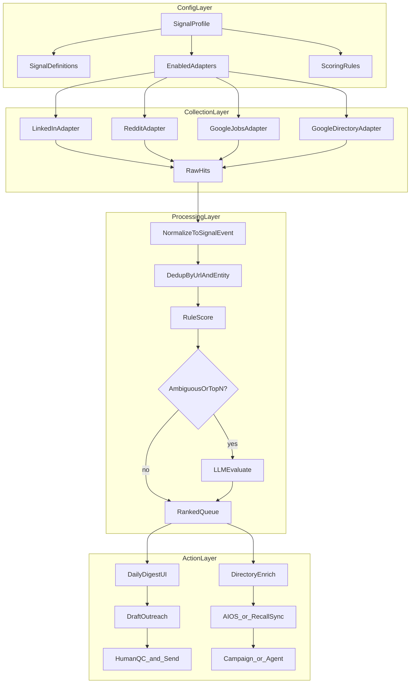

# Architecture — conceptual (not built)

High-level flow for the **full system**. See [MVP.md](./MVP.md) for what to build **first**
(ActionLayer only — queue + drafts, manual input).

**Build order:** ActionLayer → Enrichment hooks → CollectionLayer → ProcessingLayer (scoring/dedup).

---

## End-to-end flow (full vision)



---

## Layers

### 1. Config layer

- **SignalProfile** per use case (see [USE-CASES.md](./USE-CASES.md))
- Versioned config — change keywords without code deploy where possible
- Lives in: DB table and/or `signals/profiles/*.yaml` (TBD)

### 2. Collection layer

- Scheduled **n8n** workflows OR dedicated sidecars per heavy scrape
- Each adapter returns normalized events — profile filters which queries/keywords run
- Cursor/watermark per (profile, adapter) for incremental runs

### 3. Processing layer

- **Normalize** — one `SignalEvent` schema ([SIGNAL-TYPES.md](./SIGNAL-TYPES.md))
- **Dedup** — URL unique; fuzzy entity merge
- **Score** — rules first; LLM on cap (top 15–20/day/profile)
- **Store** — Postgres (likely extend AIOS CRM DB)

### 4. Action layer

- **Digest** — ranked inbox + draft reply/DM (human sends v1)
- **Enrich** — optional `google_directory` pass before CRM promote
- **CRM** — create/update contact with signal metadata custom fields
- **Agent** — RecallSync campaign or channel agent for approved multi-step follow-up (later)

---

## Relationship to existing services

| Existing | Role in signal architecture |
|----------|----------------------------|
| `services/gmaps-harvester` | **Google directory adapter** — enrich + watch lists |
| `services/cursor-enrichment` | Pattern for **LLM sidecar** — evaluate text, draft outreach |
| AIOS CRM (`localhost:3010`) | **Entity store + digest UI** candidate |
| RecallSync | **Outreach execution** — campaigns, agents, conversations |
| n8n | **Orchestration** — cron, webhooks, glue between adapters and CRM |

---

## What we are NOT building (yet)

- Unified scraper monolith for all social networks
- Auto-send LinkedIn DMs in v1
- Profile editor UI (config files / admin API first)
- Real-time streaming — daily/hourly batch is enough for v1

---

## Deployment sketch (future)

```
signals/
  profiles/           # YAML configs per use case (future)
  docs/                 # this folder

services/
  gmaps-harvester/    # existing — directory adapter
  signal-evaluator/   # future? LLM evaluate + draft (or reuse cursor-enrichment)
  *-harvester/        # future adapters only if needed

n8n/
  workflows/          # per-adapter cron + CRM push (future)
```

---

## MVP (when we decide to build)

See [MVP.md](./MVP.md). Summary:

1. **Outreach queue** — manual add lead + channel + context
2. **Channel pipelines** — email copy / LinkedIn comment+connect / etc.
3. **AI draft** — one LLM call, profile voice, no ChatGPT re-prompting
4. **Status tracking** — pending → sent → replied
5. **Human send only**

Collection adapters (Reddit, Google Jobs, …) are **Phase 3**, not MVP.
