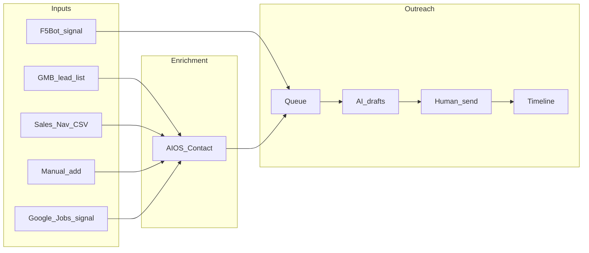

# Product spec — agreed direction (v1)

_Last updated: 2026-07-28 (session 4)_

This is the **current agreed spec** for the **Outreach** feature in AIOS CRM. Discussion until we
start building.

---

## One sentence

**Research finds or enriches contacts → you decide fit → queue drafts channel-native outreach →
you send and log a timeline.**

Not Clay. Not scrape-everything-first. Not auto-send.

---

## Decisions (locked for v1)

| # | Decision |
|---|----------|
| 1 | **UI:** New top-level tab **`Outreach`** (`/outreach`), with **internal sub-tabs** |
| 2 | **Channels:** Email, LinkedIn, Reddit (+ combined **`email_linkedin`** pipeline) |
| 3 | **LinkedIn drafts:** Comment + connection note. Enrichment when finding the person (Clay-style) |
| 4 | **`email_linkedin`:** When contact has **both** email and LinkedIn → separate coordinated pipeline. If only LinkedIn today, use LinkedIn pipeline — don't block on finding email later |
| 5 | **First profile:** **UK dental marketing / lead gen agencies** (partner motion — not practices) |
| 6 | **Tracking:** **Timeline** per outreach item — you manually log what was sent, replies received, and mark **success** yourself (no auto success detection) |
| 7 | **Geo (v1):** **London, UK** — first GMB universe pull (expand UK later) |
| 8 | **`email_linkedin` timing:** System drafts **both** email + LinkedIn copy. **You** choose when to send each and log on timeline. No auto sequencing |
| 9 | **Lead lists:** Batch inputs — GMB lists, Sales Navigator CSV → LinkedIn pipeline, manual add. See [LEAD-LISTS.md](./LEAD-LISTS.md) |
| 10 | **Copy:** Starter templates in [COPY-TEMPLATES.md](./COPY-TEMPLATES.md) — iterate from real replies later |

---

## Three layers (build in this order)



### Layer 1 — Research (minimal, not the old engine)

**Purpose:** Get people/posts **into** the system for verticals you don't organically scroll
(dental). **Not** "score everything with LLM."

| Source | Role | Status |
|--------|------|--------|
| **GMB scraper** ([gm-scraper](../app/(dashboard)/gm-scraper/)) | **Universe** — **UK dental marketing / lead gen agencies**. Name, phone, website → `Contact`. **Not practices.** | Already built |
| **Google Jobs** | **One mechanical "why now"** — agencies hiring VA / appointment setter / coordinator for **dental client** work | Build or wire (v1) |
| **F5Bot** | Reddit posts matching keywords → webhook → glance & qualify | Free external; wire webhook |
| **LinkedIn** | You browse manually; paste post/profile into queue | Manual v1 |

**Trap to avoid:** GMB list → queue → AI cold email = old Google Maps motion with better copy.
**Correct use:** GMB = who exists. Jobs filter = who has a trigger **right now**. Human qualifies
before queue.

### Layer 2 — Enrichment (Clay-like, on Contact)

When researching a person/company, store routine fit fields on existing [`Contact`](../prisma/schema.prisma):

- Company name, website, domain, industry, location, background snippet
- Email (when found) + `emailStatus`
- Person LinkedIn URL, title
- Signal context: *why now* (e.g. "hiring patient coordinator — Google Jobs 2026-07-20")
- Source + sourceUrl

Use existing `cursor-enrichment` / enrichment pipeline where it fits. **Enrichment informs fit and
drafts** — not a scoring layer that blocks outreach.

### Layer 3 — Action (the daily tool)

This is what removes ChatGPT + tab chaos.

1. Qualified contact or post lands in **outreach queue**
2. System picks **channel pipeline** (see below)
3. AI drafts channel-native copy
4. You review, send manually, log on **timeline**
5. You mark **success** when it's real

---

## Channel pipelines (v1)

Routing is automatic from contact fields + how the item entered:

| Pipeline | When | AI drafts |
|----------|------|-----------|
| `email` | Has email, no LinkedIn (or LinkedIn-only motion not desired) | Subject + body |
| `linkedin` | Has LinkedIn post/profile context; email optional/ignored for motion | Comment + connection note |
| `reddit` | Came from Reddit thread (F5Bot or manual URL) | Comment reply (peer tone) |
| `email_linkedin` | Has **both** email and LinkedIn | Email + LinkedIn comment + connection note — **all drafted together**; you send each when you choose and log on timeline |

**Rule:** Don't wait to find email if you're ready to move on LinkedIn. Pipeline can change later
if enrichment adds email (`linkedin` → `email_linkedin`).

**Not automated:** No "email day 1, LinkedIn day 3" sequence. Stage movement and send timing are
**100% manual** — the pipeline only means "here are both drafts for this contact."

---

## UI sketch (Outreach tab sub-tabs)

Top-level nav: **Outreach** → `/outreach`

| Sub-tab | Purpose |
|---------|---------|
| **Queue** | Active outreach — filter by pipeline, list, status |
| **Lists** | Lead lists (GMB batches, Sales Nav imports) — members, promote to queue |
| **Import** | Sales Navigator CSV → Contacts + LinkedIn list |
| **Timeline** | Per-item thread (also from queue row) |
| **Sources** | GMB queries, Jobs watch, F5Bot — feeds lists & signals |

**Manual add** available from Queue and Lists (+ button).  
Contact detail page links to outreach history.

See [LEAD-LISTS.md](./LEAD-LISTS.md) for list sources and flows.

---

## Timeline model (not simple sent/replied)

Each **outreach item** has an append-only **timeline**:

```
2026-07-28 10:00  system    Draft generated (linkedin pipeline)
2026-07-28 10:15  user      Sent: commented on post, connection request with note
2026-07-29 14:00  user      Received: accepted connection, replied "tell me more"
2026-07-30 09:00  user      Sent: follow-up DM (manual note)
2026-08-05 11:00  user      Status → SUCCESS (booked call)
```

- **You** add sent/received notes (free text)
- **Success** is a manual status you set — not inferred
- Drafts are timeline entries too (for audit / re-use)

---

## Dental agency partner — v1 walkthrough (UK)

**ICP:** UK **dental marketing / lead gen agencies** — shops with paying dental practice clients,
not practices themselves. Aligns with FusionSync homepage: partner with agencies, white-label
patient acquisition / integration fulfilment ([context](../context/fusionsyncai.base.md)).

1. **Universe:** GM Scraper — London queries (see [LEAD-LISTS.md](./LEAD-LISTS.md)) → **lead list**
2. **Contacts created** with company fields (existing flow) — tag/source = dental agency UK
3. **Jobs pass:** Which agencies are hiring VA / appointment setter / coordinator for dental client work
4. **Shortlist:** You review — real agency with dental vertical clients, not a solo freelancer
5. **Enrich:** Decision-maker LinkedIn + email; note stack (GHL, Dentally, Exact, etc.)
6. **Queue:** Promote with signal context (e.g. "hiring setter for dental clients")
7. **Draft:** `email_linkedin` or `linkedin` or `email` based on channels available
8. **Execute:** Copy drafts, send when you decide, log timeline, mark success manually
9. **Parallel:** F5Bot → Reddit agency posts → qualify → `reddit` pipeline ([keywords](./F5BOT-DENTAL-UK.md))

**Integrations for v1:** GMB (have) + Google Jobs (need) + F5Bot ([config](./F5BOT-DENTAL-UK.md)) + LinkedIn (manual).

**Explicitly not v1:** LinkedIn scraping, LLM score-every-hit, cross-channel dedup engine, Instagram.

---

## What we are NOT building (hold the line)

- Scoring rules + LLM-evaluate every GMB row before a human looks
- Dedup logic across four channels
- Auto-send on any channel
- Full adapter framework before first dental send from queue
- Instagram (later — same pattern as LinkedIn)

**Procrastination test:** If you're writing scoring/dedup before sending from the queue, stop.

---

## Data model sketch (future — not implemented)

```
SignalProfile          — dental_patient_acquisition, …
OutreachItem           — contactId?, pipeline, profileId, signalContext, status
OutreachTimelineEntry  — outreachItemId, type, body, createdAt, author (system|user)
SignalSourceHit        — optional: jobs match, reddit webhook payload (links to contact)
```

Reuse `Contact` heavily. Outreach is **not** a replacement for Contacts — it's the action layer
on top.

---

## Build phases

| Phase | Deliverable |
|-------|-------------|
| **A** | Outreach tab: Queue + manual add + Lists shell + AI draft + timeline |
| **A2** | Sales Navigator CSV import → LinkedIn list + queue |
| **B** | Profile config (dental voice/prompts) + pipeline routing logic |
| **C** | Google Jobs → match to existing Contacts + surface in Sources sub-tab |
| **D** | F5Bot webhook → Reddit queue items |
| **E** | Enrichment hooks (find email/LI from company website) on promote-to-queue |

Phase A+B can ship with **manual paste only** while C/D are in progress — still useful for
LinkedIn/Reddit you find by hand.

---

## Related

- [MVP.md](./MVP.md) — philosophy + anti-patterns
- [ARCHITECTURE.md](./ARCHITECTURE.md) — full future layers
- [USE-CASES.md](./USE-CASES.md) — profile details
- [LEAD-LISTS.md](./LEAD-LISTS.md) — GMB, Sales Nav, manual inputs
- [COPY-TEMPLATES.md](./COPY-TEMPLATES.md) — starter draft copy
- AIOS `Contact` + `GmScraperQuery`: [prisma/schema.prisma](../prisma/schema.prisma)
