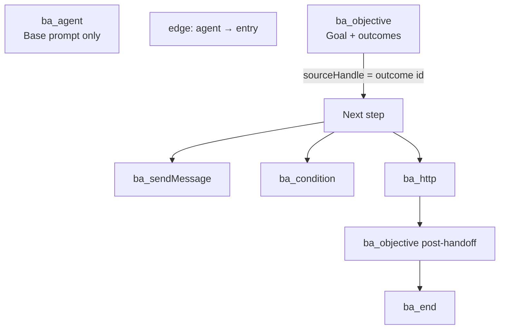

# SOP: Author a flow-based (FLOW) channel agent

## Purpose
Design and maintain a **multi-step flow graph** for a `FLOW` channel agent (`baseAgentType = FLOW`).
FLOW agents are for **scalable, complex, reliable** behavior where routing, qualification stages,
HTTP handoffs, and post-handoff messaging need explicit structure — not one monolithic prompt.

> For single-prompt agents use `prompting-standard.md` (STANDARD) instead.

## Golden rule: read context first
**Always** read the root `/context` folder before authoring (e.g. `context/fusionsyncai.base.md`,
`context/fusionsyncai-contact-info.md`). Brand voice, guardrails, and offers belong primarily in
the **`ba_agent`** node; per-stage goals live in **`ba_objective`** nodes.

## Mental model: STANDARD vs FLOW

| | STANDARD | FLOW |
|---|---|---|
| Behavior | One `prompt` on `BaseAgent` | Graph: `ba_agent` + steps + edges |
| Routing | Implicit in one LLM turn | Explicit via objectives / conditions |
| Handoffs | `BaseAgent.tools` (LLM tool calls) | `ba_http` nodes (deterministic HTTP) |
| Repo artifact | `channel-agent-prompt.md` | `channel-agent-flow.json` (exact export) |
| Live field | `BaseAgent.prompt` | `BaseAgent.currentFlow` (draft), `BaseAgent.flow` (published) |

## Flow JSON shape (v2 — canonical)

The builder and runtime use **version 2** React Flow JSON. Store the **exported bundle** in AIOS
(same shape as RecallSync export):

```json
{
  "exportKind": "insta_os_base_agent_flow",
  "exportedAt": "...",
  "agentId": "...",
  "agentName": "...",
  "flow": {
    "version": 2,
    "agentRootId": "flow-agent-root",
    "entryNodeId": "flow-objective-1",
    "nodes": [ ... ],
    "edges": [ ... ]
  },
  "flowSettings": {}
}
```

For day-to-day AIOS work, the **canonical editable file** is the full bundle (or at minimum the
`flow` object — but prefer keeping the bundle so `agentId` / metadata stay aligned):

`agents/primary-agent/<primary-agent-name>/<channel>/channel-agent-flow.json`

Link metadata in `channel-agent.yaml` (`baseAgentType: FLOW`, `id`, sync timestamps).

> Older v1 shapes (`type: "objective"`, `targetNodeId` on outcomes) are migrated to v2 on import.
> Author **v2** only (`ba_*` node types + `edges[]`).

## Graph anatomy



- **`agentRootId`** — must point to the single `ba_agent` node.
- **`entryNodeId`** — first step after the agent; runtime also requires **exactly one** edge from
  `agentRootId` to that node (`sourceHandle` null or `out`).
- **`edges`** — wire steps. Objective branches use `sourceHandle` = outcome **id** (e.g.
  `user_is_interested`). HTTP / sendMessage continuation uses `out` → next node `in`.

## Node types (composition)

### `ba_agent` — Flow agent (base prompt)

**Role:** Persona, channel context, company context, communication style, FAQs, guardrails,
response rules. **Does not include the stage goal** — goals belong in objectives.

| Field | Location | Notes |
|---|---|---|
| `prompt` | `node.data.prompt` | Large markdown; channel-specific (IG DM vs email vs WhatsApp). |
| `settings` | `node.data.settings` | Optional; runtime/agent config (not the main authoring surface). |

**Do not put:** qualification goals, outcome triggers, or "call webhook when X" — use objectives
and HTTP nodes.

**Tools:** In v2, HTTP tools on the agent root are loaded from DB `AgentTool` links in the UI —
not embedded in exported JSON. STANDARD agents use `BaseAgent.tools`; FLOW handoffs are usually
**`ba_http` nodes**.

### `ba_objective` — Objective (goal + routing)

**Role:** One conversational **stage** with a clear goal. The runtime classifies the thread into
**one outcome** per turn (when outcomes exist), then follows the matching edge.

| Field | Notes |
|---|---|
| `goal` | What this stage must achieve (e.g. engage, collect contact info). |
| `instructions` | How to behave in this stage (tone, question limits, when to branch). |
| `outcomeInstructions` | Optional extra guidance for the classification tool (often empty in exports). |
| `outcomes[]` | `{ id, description }` — each `id` becomes an edge `sourceHandle`. |

**Outcome `id` rules:**
- Use stable snake_case ids (e.g. `user_is_interested`, `contact_information_collected`).
- **`description`** tells the classifier **when** to pick this outcome (not shown to the user as UI copy).
- Every outcome you want to branch on **must** have an edge: `source → target`, `sourceHandle = id`.
- Special id `no-event` (v1 legacy): stay on objective, reply, end turn — rarely needed in v2 exports.

**If `outcomes` is empty:** the node only generates a reply for the goal (no branching) and ends the turn.

**Example pattern (from live agent):**
1. **Engagement** — goal: explain product, light qualify; outcome `user_is_interested` → Info Collection.
2. **Info Collection** — goal: name + phone; outcome `contact_information_collected` → HTTP handoff.
3. **Post Handoff** — goal: thank + remain helpful; outcomes `[]`.

### `ba_sendMessage` — Send message

**Role:** Emit a message mid-flow — **static** text or **prompt-generated** reply.

| Field | Notes |
|---|---|
| `mode` | `static` \| `prompt` |
| `text` | Required when `static`. |
| `promptHint` | Hint when `prompt` (may omit base agent prompt unless `includeBasePrompt: true`). |
| `standalone` | If `true`, flow **stops** after send (no auto-continue to `out` edge in same turn). |
| `includeBasePrompt` | Default `false` for prompt mode — only the hint + channel wrapper. |

Edges: optional `out` → next node.

### `ba_condition` — Condition (branch)

**Role:** Route without a conversational goal — by **conversation classification** or **CRM data**.

| `data.kind` | Behavior |
|---|---|
| `conversation` | LLM picks a branch from `outcomes[]` + `instructions` (like lightweight objective routing). |
| `crm` | Evaluates lead tags/custom fields via `conditionalBranches` + `conditionalFallback` (no LLM). |

Edges: `sourceHandle` = outcome id, or `fallback` for CRM fallback path.

### `ba_http` — HTTP request

**Role:** Deterministic external call (n8n, CRM, task creation). **No user-facing reply** from this
node itself — execution continues to the `out` edge target.

| Field | Notes |
|---|---|
| `url` | http(s) endpoint. |
| `method` | `GET` \| `POST`. |
| `headersJson` | JSON string of headers. **Secrets — not committed to repo** (use RecallSync / push-time only). |
| `bodyMode` | `static` (raw `bodyJson`) \| `ai` (model fills `bodyAiFields` from full thread). |
| `bodyAiFields[]` | `{ name, description, type }` — e.g. `name`, `phone`, `summary`, `company`. |

**Runtime metadata (automatic):**
- Query: `leadId`, `baseAgentId`, `baseAgentChannel`.
- POST body also includes `recallInstaOsMeta: { leadId, baseAgentId, baseAgentChannel }` merged
  with AI/static body fields.

Use **`ba_http`** for qualification handoffs; do not rely on STANDARD-style `BaseAgent.tools` in FLOW.

**Before wiring any `ba_http` URL, curl-verify it** (status/auth/path) per the "Mandatory: curl-verify
the endpoint" rule in `tool-calls.md`. n8n nodes in particular may expect **Basic** auth even when a
`Bearer` value was provided — a `403` with `WWW-Authenticate: Basic` means the auth scheme is wrong.

### `ba_end` — End

**Role:** Terminates the flow session (`flowEndedAt` set). No outgoing edges.

## Authoring process (AIOS)

1. **Read `/context`.**
2. Confirm agent: `get-primary-agents` → `baseAgentType = FLOW`, capture `baseAgentId`.
3. **Pull latest first (mandatory).** Run pull-before-edit per `sync.md`: pull the live agent
   (`get-channel-agent`) and full-overwrite the local `channel-agent-flow.json` from `currentFlow`
   (then normalize secrets) so you edit on top of current live. If the local copy has unsaved edits,
   stop and ask the owner before overwriting.
4. **Discovery** with owner: stages (engage → collect → handoff → post-handoff), channels, outcomes,
   webhook fields, tone per stage.
4. **Export** current flow from RecallSync UI (or copy from a reference agent) → save as
   `channel-agent-flow.json` under the channel folder.
5. Edit JSON **in place** (precise changes only — preserve `id`s unless intentionally rewiring).
6. Validate mentally / in UI import:
   - `version: 2`, one `ba_agent`, `agentRootId` matches that node.
   - Exactly one agent→entry edge.
   - Every outcome id used in objectives has a matching edge.
   - No cycles (DAG).
   - HTTP nodes: POST + `bodyMode: ai` when fields are conversational (name, phone, summary).
7. **Sync draft** to RecallSync `currentFlow` (see **Sync** below).
8. **Test** per `testing.md` (clear history, multi-turn scenarios, verify HTTP at n8n).
9. Owner approves → **publish** in UI (promotes draft to `flow`) → activate agent if ready.

## JSON edit rules (do / don't)

**Do:**
- Keep node `id`s stable when editing copy (edges reference ids).
- Match `sourceHandle` on edges to outcome `id` exactly.
- Put long persona copy in `ba_agent.data.prompt`.
- Put stage goals only in `ba_objective.data.goal`.
- Use neutral/industry-safe language in agent prompt until user states their business (same as STANDARD).

**Don't:**
- Put secrets in committed JSON (`headersJson` with tokens) — document header **names** in a
  sidecar note or supply at sync time.
- Change `entryNodeId` without fixing the agent→entry edge target.
- Duplicate outcome ids on the same objective.
- Mix v1 node types (`type: "objective"`) into new work — use `ba_objective`.

## Sync to RecallSync

RecallSync stores two flow fields on `BaseAgent`:

| Field | Meaning |
|---|---|
| `currentFlow` | **Draft** — what tests and the builder edit. |
| `flow` | **Published** — live after "Publish" in UI. |

AIOS workflow: push edits to **`currentFlow`** first; publish only after approval.

### MCP `set-channel-agent-flow-draft` (built)

Primary sync path from AIOS — mirrors `saveFlowDraft` / `importFlowDraft`:

- **Input:** `{ id: <baseAgentId>, flow: <flow object or full bundle>, publish?: boolean }`
- **Behavior:** validates/migrates to v2 server-side, writes `currentFlow`. `publish: true` also
  promotes the draft to the live `flow` field.
- **Secrets:** keep `${ENV_VAR}` placeholders in the committed JSON. At push time run
  `scripts/reconcile-flow.mjs --flow <path>` — it substitutes the env value and **encrypts** the
  bearer header, printing the reconciled JSON. Pass that JSON to the MCP tool. The agent never reads
  env files or handles plaintext.

All pushes go through **MCP** (`set-channel-agent-flow-draft`). UI alternative: Import bundle / Save
draft on the flow builder.

## Human-in-the-loop

Owner approves the full flow (stages, outcomes, HTTP payload fields, and agent base prompt) before
publish and activation.

## Output

- `channel-agent-flow.json` — exact exported bundle (versioned in Git).
- `channel-agent.yaml` — link `id`, `baseAgentType: FLOW`, sync metadata.
- Draft synced to `currentFlow` on RecallSync via MCP (`set-channel-agent-flow-draft`).

## Done criteria

- [ ] `/context` read; `ba_agent` prompt reflects brand + channel
- [ ] Each `ba_objective` has clear goal, instructions, and wired outcomes
- [ ] `ba_http` handoff fields + URL confirmed with owner; secrets not in Git
- [ ] `channel-agent-flow.json` committed; edges/outcome ids consistent
- [ ] Draft on RecallSync (`currentFlow`); tested per `testing.md`
- [ ] Owner approved publish / activation

## Related SOPs

- `sync.md` — pull-before-edit + push (live wins on pull, local wins on push)
- `prompting-standard.md` — single-prompt agents
- `tool-calls.md` — STANDARD `BaseAgent.tools` (FLOW uses `ba_http` instead)
- `testing.md` — test lead, clear history, multi-turn FLOW notes
- `creation.md` — provision agent + folder layout
- `flow-troubleshooting.md` — real failure patterns + fixes (eager routing, outcome misfires, branch leakage, chatty post-handoff)
